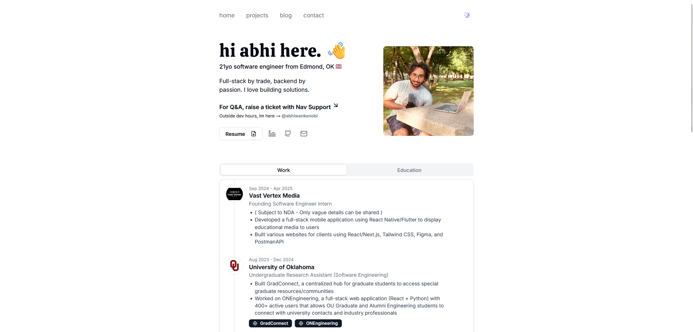

# My Personal Portfolio

This portfolio was heavily inspired by tedawf.com

A clean, minimal portfolio website built with Next.js, Tailwind CSS, and Shadcn UI. Features an AI chatbot, email contact form, and blog.

## Live Demo

🌐 Check it out here: **[https://navpil.dev](https://navpil.dev)**



## Features

- Minimal design with Shadcn UI
- Light/dark mode toggle
- Contact form with email integration
- Responsive mobile design
- Blog section

## Tech Stack

- Next.js
- Tailwind CSS
- Shadcn UI
- OpenAI API (chatbot)
- Vercel (hosting)
- AstraDB (vector storage)
- Upstash (caching)
- Resend (email)

## Getting Started

```bash
git clone https://github.com/NavPilDev/nav-portfolio nav-portfolio
cd nav-portfolio
npm install
cp .env.example .env.local
# Add your own API keys to .env.local
npm run dev
```

## Environment Variables

```env
OPENAI_API_KEY=your_key
ASTRA_DB_APPLICATION_TOKEN=your_token
ASTRA_DB_ENDPOINT=your_endpoint
UPSTASH_REDIS_REST_URL=your_url
UPSTASH_REDIS_REST_TOKEN=your_token
```

## Customization

- Update personal info in `src/data/*.json`
- Replace projects in `src/data/projects.json`
- Replace blog posts in `content/` or remove it.
- Add your resume to `public/resume.pdf`
- Modify chatbot prompt in `src/app/api/chat/route.ts`

## Deployment

Deploy to Vercel:

1. Push to GitHub
2. Connect repo to Vercel
3. Add environment variables
4. Deploy

## Costs

- Domain: ~$12/year
- Hosting/DB: Free tiers

## License

MIT

